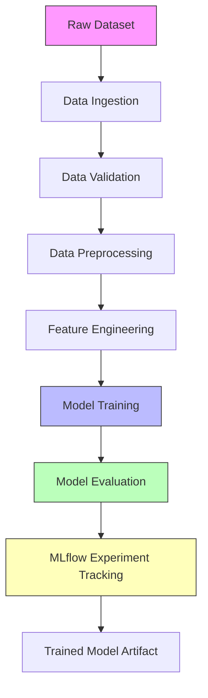

# 🌾 End-to-End Crop Yield Prediction System


An **End-to-End Machine Learning Pipeline** for predicting crop yield using structured agricultural data.

This project demonstrates **industry-level ML engineering practices**, including:

* Modular ML pipeline
* Data versioning using **DVC**
* Experiment tracking with **MLflow**
* Config-driven architecture
* Reproducible pipelines
* Clean logging system

---

# 📌 Project Overview

Crop yield prediction is a crucial task in **agriculture analytics**, helping farmers and researchers make informed decisions.

This system:

1. Ingests raw crop data
2. Validates the dataset
3. Performs preprocessing
4. Trains ML models
5. Evaluates model performance
6. Tracks experiments using MLflow
7. Uses DVC to manage datasets and pipelines

---

# ⚙️ Tech Stack

| Technology     | Purpose                    |
| -------------- | -------------------------- |
| Python         | Core programming           |
| Scikit-Learn   | Machine Learning models    |
| Pandas / NumPy | Data processing            |
| DVC            | Data & pipeline versioning |
| MLflow         | Experiment tracking        |
| YAML           | Configuration management   |
| Git            | Version control            |

---

# 🏗️ Project Architecture

```
ML-EndToEnd-Crop-Yield-Prediction-System
│
├── config/
│   └── params.yaml
│
├── data/
│   └── raw/
│
├── logs/
│
├── src/
│   └── crop_yield_prediction/
│       ├── components/
│       │   ├── data_ingestion.py
│       │   ├── data_validation.py
│       │   ├── data_preprocessing.py
│       │   ├── model_training.py
│       │   └── model_evaluation.py
│       │
│       ├── configuration/
│       │   └── config.py
│       │
│       ├── entity/
│       │   └── config_entity.py
│       │
│       ├── pipeline/
│       │   ├── stage_01_data_ingestion.py
│       │   ├── stage_02_data_validation.py
│       │   ├── stage_03_data_preprocessing.py
│       │   ├── stage_04_model_training.py
│       │   └── stage_05_model_evaluation.py
│       │
│       └── utils/
│           └── logger.py
│
├── dvc.yaml
├── dvc.lock
├── main.py
└── README.md
```

---

# 🏗️ ML Pipeline Architecture



---

# 🔄 Machine Learning Pipeline

The pipeline consists of **5 stages**:

### 1️⃣ Data Ingestion

* Loads raw dataset
* Stores dataset in project structure
* Versioned with **DVC**

### 2️⃣ Data Validation

* Checks dataset schema
* Ensures data quality
* Verifies column structure

### 3️⃣ Data Preprocessing

* Handles missing values
* Feature engineering
* Data transformation

### 4️⃣ Model Training

* Trains ML models
* Uses **Scikit-Learn**
* Hyperparameters controlled via `params.yaml`

### 5️⃣ Model Evaluation

* Calculates evaluation metrics
* Logs results to **MLflow**

---

# 📊 Models Used

Example models included in the project:

* Linear Regression
* Ridge Regression
* Lasso Regression
* ElasticNet
* Decision Tree Regressor
* Gradient Boosting Regressor
* SVR
* KNN Regressor

Evaluation Metrics:

* RMSE
* R² Score

---

# 📦 Installation

Clone the repository:

```bash
git clone https://github.com/Himadri-G/ML-EndToEnd-Crop-Recommandation-system.git
cd ML-EndToEnd-Crop-Recommandation-system
```

Create virtual environment:

```bash
python -m venv project_env
```

Activate environment (Windows):

```bash
project_env\Scripts\activate
```

Install dependencies:

```bash
pip install -r requirements.txt
```

---

# ▶️ Run the Pipeline

Run the full ML pipeline:

```bash
python main.py
```

---

# 🔁 Run using DVC Pipeline

Run the entire pipeline:

```bash
dvc repro
```

Check pipeline stages:

```bash
dvc dag
```

---

# 📊 Experiment Tracking (MLflow)

Start MLflow UI:

```bash
mlflow ui
```

Open in browser:

```
http://127.0.0.1:5000
```

MLflow tracks:

* Parameters
* Metrics
* Models
* Experiments

---

# 📁 Data Version Control (DVC)

Initialize DVC:

```bash
dvc init
```

Track dataset:

```bash
dvc add data/raw/crop_yield_prediction.csv
```

Push data:

```bash
dvc push
```

---

# 🧪 Logging System

Custom logging implemented using:

```
src/crop_yield_prediction/utils/logger.py
```

Logs are stored in:

```
logs/
```

Example logs:

* pipeline.log
* data_ingestion.log
* model_training.log
* model_evaluation.log

---

# 🚀 Key Features

✅ End-to-End ML Pipeline
✅ Modular Code Architecture
✅ Data Versioning using DVC
✅ Experiment Tracking with MLflow
✅ Config Driven Development
✅ Professional Logging System
✅ Reproducible ML Workflow

---

# 📈 Future Improvements

* Add **FastAPI for model serving**
* Deploy with **Docker**
* Add **CI/CD pipeline**
* Deploy on **AWS / GCP**

---

# 👨‍💻 Author

**Himadri Goswami**

BCA(H) Student | Aspiring AI Engineer | Machine Learning Enthusiast

GitHub:
https://github.com/Himadri-G

---

# ⭐ Support

If you like this project:

⭐ Star the repository
🍴 Fork the project
📢 Share with others
